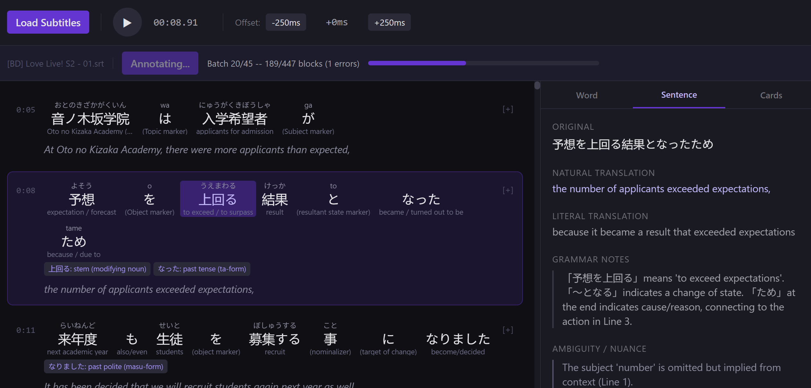

# Anime Subtitle Companion

An AI-powered companion app for Japanese learners. Load subtitle files, get rich interlinear annotations powered by a local LLM, and study anime dialogue with clickable tokens, grammar breakdowns, and flashcard saving.



## Features

- **Interlinear subtitle display** — readings (furigana) above, English glosses below each word
- **AI-powered annotation** — batch-processes subtitle blocks through any OpenAI-compatible LLM for tokenization, grammar analysis, and translation
- **Interactive tokens** — click any word for detailed breakdown: dictionary form, part of speech, conjugation, grammar role, and external dictionary links (Jisho, Wiktionary)
- **Sentence-level grammar** — grammar notes, literal/natural translations, and ambiguity notes for each line
- **Flashcard saving** — save words with their sentence context to a local flashcard deck
- **Playback timer with sync** — local timer with manual offset controls to sync with streaming video
- **Progressive annotation** — results appear in real-time as batches complete; resume mid-job if the browser restarts
- **Session persistence** — previously loaded subtitle sets are saved and can be reopened instantly with cached annotations

## Stack

- **Backend:** Python 3.11+ / FastAPI / SQLite / pysubs2
- **Frontend:** React 19 / TypeScript / Vite / Tailwind CSS v4
- **LLM:** Any OpenAI-compatible inference server (LM Studio, Ollama, vLLM, etc.)

## Quick Start

### Prerequisites

- Python 3.11+
- Node.js 18+
- An OpenAI-compatible LLM server running (local or remote)

### Setup

```bash
# Clone and enter the repo
git clone <repo-url>
cd anime-subtitle-companion

# Install backend dependencies
cd backend && pip install -e . && cd ..

# Install frontend dependencies
cd frontend && npm install && cd ..

# Configure your LLM endpoint
cp .env.example .env
# Edit .env with your LLM server details
```

### Configure `.env`

```env
# LLM — any OpenAI-compatible endpoint
LLM_API_BASE=http://localhost:1234/v1
LLM_API_KEY=not-needed
LLM_MODEL=your-model-name
LLM_MAX_TOKENS=32768
```

### Run

```bash
# Single command starts both backend and frontend
python run.py
```

Open `http://localhost:5173` in your browser.

### Production

```bash
# Builds frontend, then serves everything from FastAPI on port 8000
python run.py --prod
```

## Usage

1. Click **Load Subtitles** and upload an `.ass`, `.ssa`, or `.srt` file
2. Click **Annotate with AI** to start batch annotation — results appear progressively
3. Click any word in the transcript for detailed analysis in the side panel
4. Use the **Sentence** tab for full grammar breakdown of the selected line
5. Click **+ Card** on any word to save it as a flashcard with sentence context
6. Use the playback timer and offset controls to sync with your streaming video

## Project Structure

```
anime-subtitle-companion/
├── run.py                  # Unified dev/prod runner
├── backend/
│   ├── app/
│   │   ├── main.py         # FastAPI app + logging setup
│   │   ├── config.py       # Settings from .env
│   │   ├── db.py           # SQLite schema + helpers
│   │   ├── api/            # REST endpoints
│   │   ├── models/         # Pydantic schemas
│   │   └── services/       # LLM client, parser, annotation
│   └── pyproject.toml
├── frontend/
│   ├── src/
│   │   ├── components/     # React UI components
│   │   ├── hooks/          # Playback timer, active block
│   │   ├── lib/            # API client
│   │   ├── types/          # TypeScript interfaces
│   │   └── styles/         # Tailwind + custom CSS
│   └── package.json
├── docs/
│   └── screenshot.png
└── sample-data/
    └── subtitles/
```
